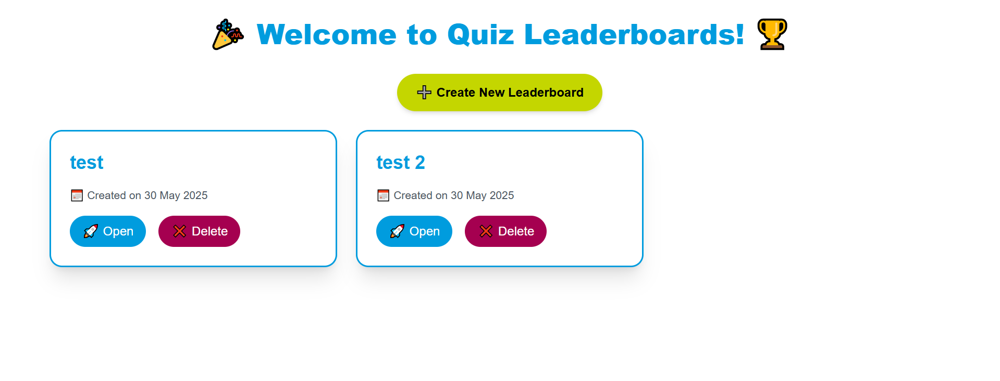
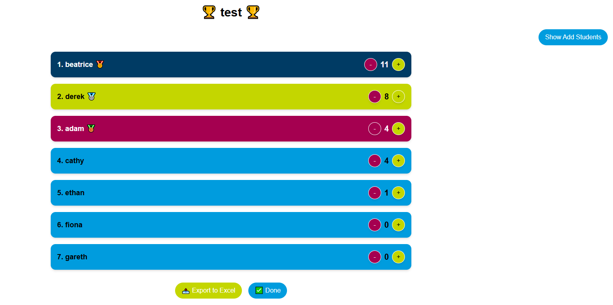
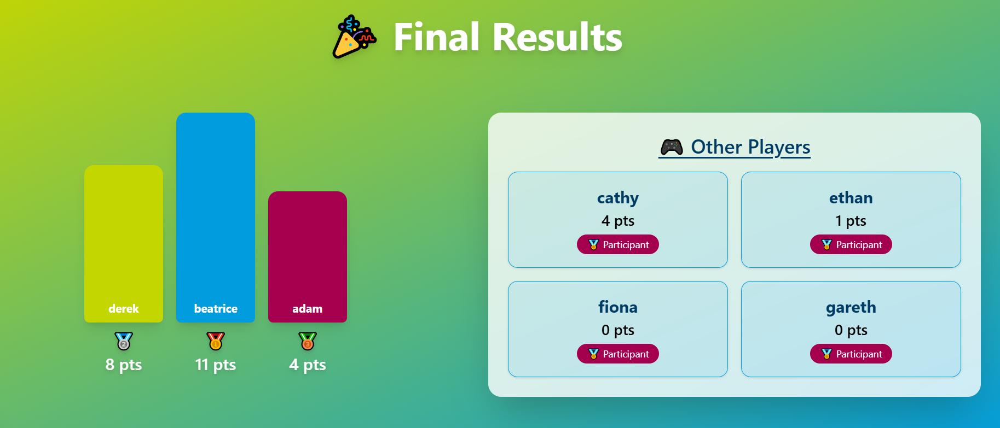

# 🏆 Interactive Leaderboard Web App

An engaging, kid-friendly leaderboard web application designed for classrooms, competitions, and interactive events! Built with **Next.js**, **React**, **TypeScript**, **Tailwind CSS**, and **localStorage**, the app makes it fun and simple to manage points, celebrate top performers, and involve students.

---

## ✨ Features

### 🎮 Game-Style Leaderboard

* Add students manually or via Excel import.
* Give or remove points in real-time using animated + / - buttons.
* Automatically sorts students by score.
* Podium-style results screen for the top 3.

### 🖼️ Visual Design

* Cheerful, colorful UI using a custom color palette:

  * `primary`: #009cde
  * `secondary`: #c4d600
  * `accent`: #a50050
  * `darkblue`: #003b64
* Smooth animations and shadows for interactive feedback.
* Kid-friendly layout with responsive design.

### 📥 Export & Sharing

* Export leaderboard data to Excel with one click.
* Animated celebration on the final results screen.

---

## 📂 Project Structure

```
/pages
├── index.tsx              → Homepage (create or view leaderboards)
├── leaderboard/[id].tsx  → Live leaderboard control panel
├── done/[id].tsx         → Results screen with podium

/utils
├── storage.ts            → localStorage handling for leaderboards
├── excel.ts              → Excel export logic
```

---

## ⚙️ Tech Stack

* **Frontend**: Next.js, React, TypeScript
* **Styling**: Tailwind CSS
* **State**: useState / useEffect, localStorage
* **Export**: SheetJS (xlsx)

---

## 🛠️ How to Run Locally

```bash
# 1. Clone the repo
$ git clone https://github.com/your-username/leaderboard-app.git
$ cd leaderboard-app

# 2. Install dependencies
$ npm install

# 3. Run the development server
$ npm run dev

# App runs at http://localhost:3000
```

---

## 🎨 Customization

### Tailwind Theme Colors (`tailwind.config.js`):

```js
colors: {
  primary: '#009cde',
  secondary: '#c4d600',
  accent: '#a50050',
  darkblue: '#003b64',
  black: '#000000',
  white: '#ffffff',
}
```

You can adjust these colors to match your branding or event theme.

---

## 🚀 Deployment

This website is deployed and can be used at: 

* **Vercel** (recommended)
* **Netlify**
* **Render**
* **GitHub Pages** (via static export)

---

## 🥳 Ideal Use Cases

* Classroom competitions
* Workshop scoring
* Quiz games for kids
* Interactive learning leaderboards

---

## 📸 Screenshots

> 
> 
> 

---

## 🙌 Credits

Built with ❤️ using React and Tailwind CSS by \[Your Name].

---

## 📬 Contact

If you have suggestions or want to contribute:

* GitHub Issues / Pull Requests welcome
* Email: \[[your.email@example.com](mailto:your.email@example.com)]

---

## 📄 License

MIT License. Use it freely in your projects and educational settings!
